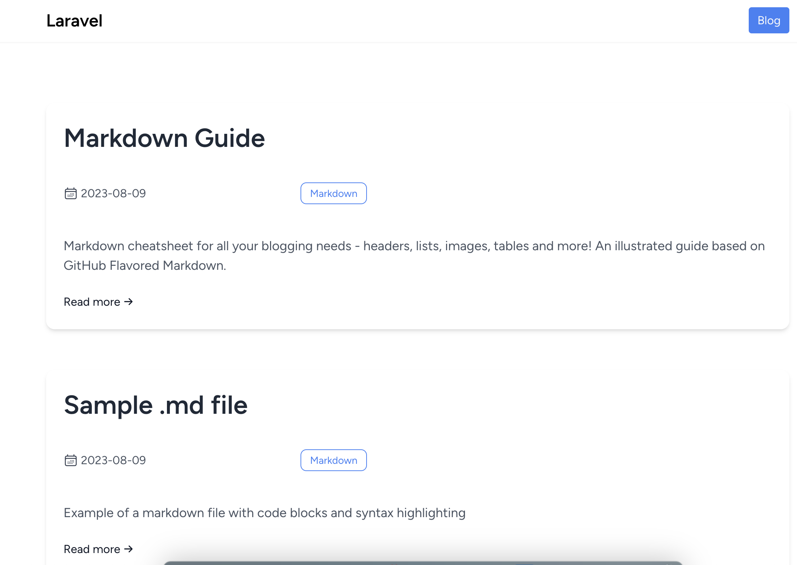

# Build Blog Laravel 10 with markdown file

<hr>



<hr>

### How to clone

-   Clone this project

    -   Step 1: `composer install`
    -   Step 2: ` npm install`
    -   Step 3: cp .env.example .env
    -   Step 4: `php artisan key:generate`
    -   Step 5: `npm run build`
    -   Step 6: `npm run dev`
    -   Step 7: ` php artisan serve`

    Or you can do (**In step 3 and step 4 i have merged into 1 step**)

    -   Step 1: `composer install`
    -   Step 2: `npm install`
    -   Step 3: `php artisan clone`
    -   Step 4: `npm run build`
    -   Step 5: `npm run dev`
    -   Step 6: `php artisan serve`

### Step to make project

1. Install tailwincss, plugin

    ```
        https://tailwindcss.com/docs/guides/laravel
        https://tailwindcss.com/docs/typography-plugin
    ```

    - Config follow guide

2. Install sheets, laravel-markdown

    ```
        https://github.com/spatie/sheets
        https://spatie.be/docs/laravel-markdown/v1/installation-setup
    ```

    - Config follow guide
    - Register custom route for Sheet in _RouteServiceProvider_
    - Customize parser markdown with **laravel markdown** in _App/ContentParsers/MarkdownWithFrontMatterParser_

3. Implement posts
    - Make model, controller, view, routes
4. Implement tags
    - Make controller, view, route
5. Create posts markdown file in `storage/app/posts`

-   Structure of markdown file

    > Name file format : [date.name.md]

    **eg:** 2023-08-08.first-blog.md

    ```[md]
        ---
        title: Your title here

        author: Nam of author

        teaser: Your teaser

        tags : ['tag1','tag2']

        ---

        Content here !
    ```

#### \*\* Enhancement

1. ##### Make command to generate bootstrap blog file

    - Install dependencies
        ```
            npm i --save prompts
            npm i --save dedent
        ```
    - Run command by

        ```[js]
            node generatePost.js
        ```

        And result

        ```[md]
                ---
                title: New Blog
                author: Tuantq
                tags: []
                teaser:
                ---
                Content go here !
        ```
